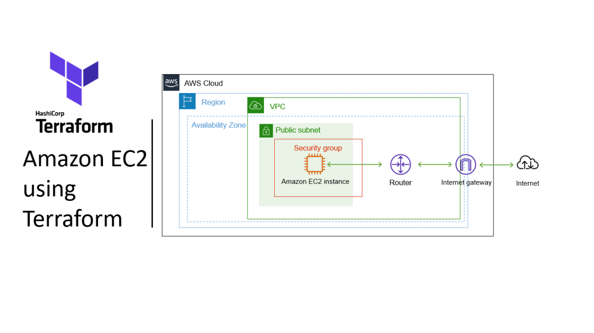

# Deploy Amazon EC2 using Terraform



##
Before running Terraform, configure your AWS credentials locally:
```bash
aws configure --profile $profile
```

## Installation of providers
This project uses the AWS provider with a locally configured profile.
```hcl
provider "aws" {
    profile = "$profile"
    region = "$region"
}

terraform {
  required_providers {
    aws = {
      source  = "hashicorp/aws"
      version = "~> 5.92"
    }
  }

  required_version = ">= 1.2"
}

```
# Infrastructure Setup

## VPC and Networking

### 1. VPC Creation
```hcl
resource "aws_vpc" "main" {
    cidr_block = "10.0.0.0/16"
    enable_dns_support   = true
    enable_dns_hostnames = true
    tags =  {
        Name = "main"
    }
}
```
### 2. Internet Gateway
```hcl
resource "aws_internet_gateway" "gw_vpc_main"{
    vpc_id = aws_vpc.main.id

    tags = {
        Name = "gw_vpc_main"
    }
}
```

### 3. Creating subnet
At this point, the subnet is not public because it is not associated with a route table that routes traffic to an Internet Gateway (IGW).

```hcl
resource "aws_subnet" "Public_main" {
    vpc_id = aws_vpc.main.id
    cidr_block = "10.0.1.0/24"
    availability_zone = "us-east-1a"
    map_public_ip_on_launch = true

    tags = {
        Name = "Public-main"
    }
}
```

### 4. Route Table
```hcl
resource "aws_route_table" "public_main_rt" {
    vpc_id = aws_vpc.main.id

    route {
        cidr_block = "0.0.0.0/0"
        gateway_id = aws_internet_gateway.gw_vpc_main.id
    }

    tags = {
        Name = "public-main-rt"
    }
}
```

### 5. Associate Route Table with Subnet
```hcl
resource "aws_route_table_association" "public_main_asso" {
    subnet_id = aws_subnet.Public_main.id
    route_table_id = aws_route_table.public_main_rt.id
}
```

### 6. Security Group
This allows all outbound traffic, which is common in simple setups but not recommended for production environments.
```hcl
resource "aws_security_group" "web_sg" {
    vpc_id = aws_vpc.main.id
    name = "web-sg"
    description = "Allow inbound HTTP (port 80) traffic from anywhere"

    ingress {
        from_port = 80
        to_port = 80
        protocol = "tcp"
        cidr_blocks = ["0.0.0.0/0"]
    }

    egress {
    from_port   = 0
    to_port     = 0
    protocol    = "-1"
    cidr_blocks = ["0.0.0.0/0"]
    }

    tags = {
        Name = "web-sg"
    }
}
```

## EC2
This EC2 instance is configured to run a basic Apache web server using user_data, allowing it to serve a simple HTML page over HTTP.
```hcl
resource "aws_instance" "main_ec2" {
    ami = "ami-02dfbd4ff395f2a1b"
    instance_type = "t3.micro"
    subnet_id = aws_subnet.Public_main.id
    vpc_security_group_ids = [aws_security_group.web_sg.id]
  
    user_data = <<-EOT
        #!/bin/bash
        dnf update -y
        dnf install -y httpd
        systemctl start httpd
        systemctl enable httpd
        echo '<h1>Hello World!</h1>' > /var/www/html/index.html
    EOT

    tags = {
        Name = "SimpleWebServer"
    }
}
```

# Terraform
```bash
# Initialize Terraform (download providers)
terraform init

# Preview the infrastructure changes
terraform plan

# Apply the configuration (create resources)
terraform apply -auto--approve
```

# Summary
This project demonstrates the deployment of a basic cloud infrastructure using Terraform on Amazon Web Services.

## The infrastructure includes:
- A VPC with DNS support enabled
- An Internet Gateway (IGW) to allow internet connectivity
- A public subnet configured to assign public IP addresses
- A route table that directs all outbound traffic (0.0.0.0/0) to the IGW
- An association between the subnet and the route table
- A security group allowing inbound HTTP (port 80) traffic
- An EC2 instance deployed in the public subnet